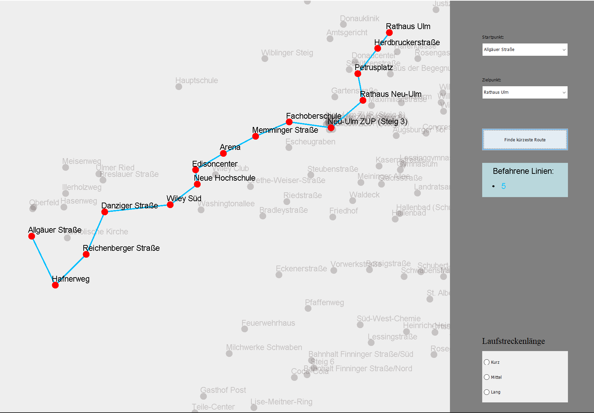
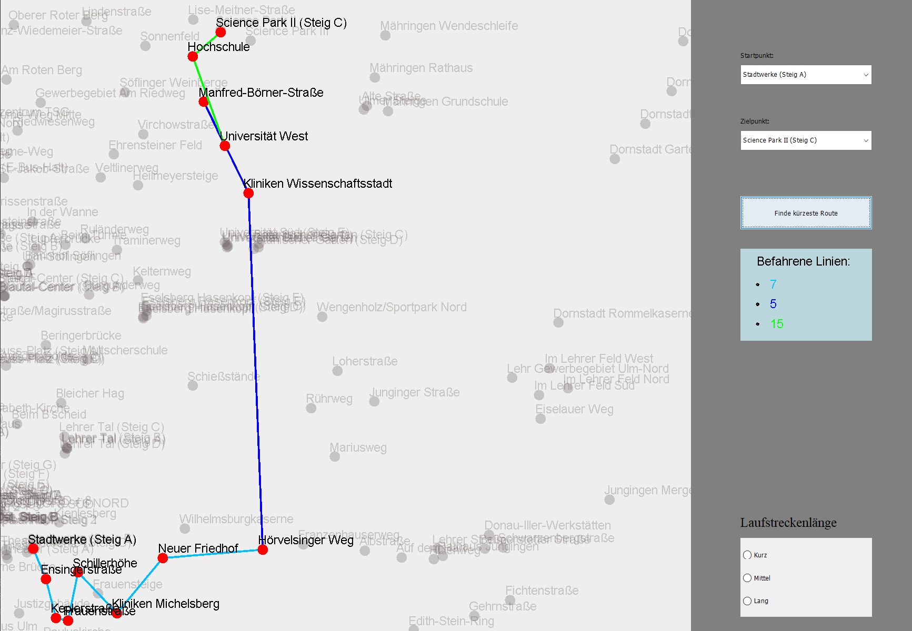
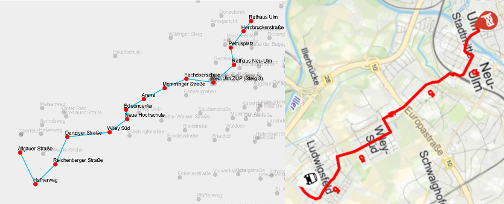

# Bus navigation
Bus navigation indicates which route and bus line leads from start stop to the destination stop.  
I maintained the bus data through OpenStreetMap and read them at every start from an XML-Document. In order to read the file I used [JDOM](http://www.jdom.org/).  
As I loaded the data somewhere in January 2020, some routes might be outdatet.

As seen here, the routes almost look like the real ones. However, they are **not** oriented to the north.  

created with data from OpenStreetMap (https://www.openstreetmap.org/copyright)
license: CC BY-SA 2.0
